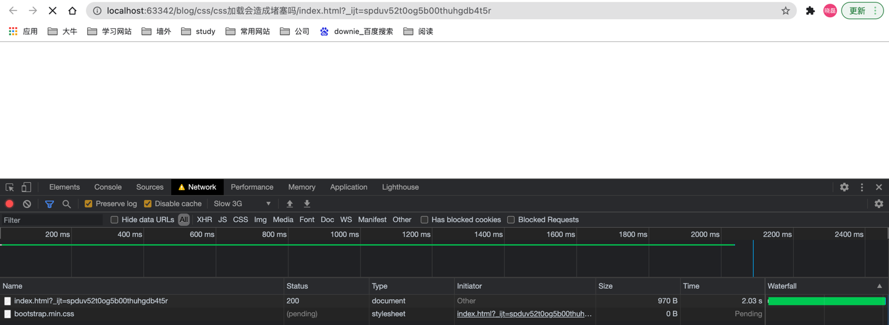
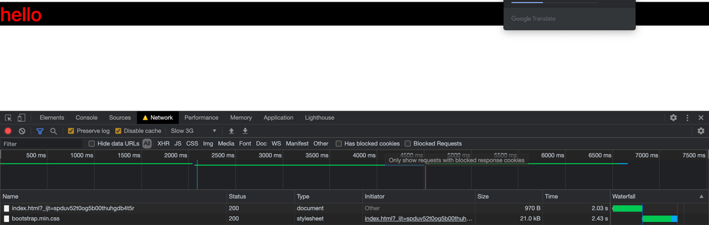

# css
## css的加载会造成堵塞吗
因为一个HTML中，主要的元素就是，html、js、css(即前端的三大基础)，所以我们需要从css的角度出发，考虑以下几个问题
1. css的加载会堵塞浏览器的解析html吗
2. css的加载会堵塞html的渲染吗
3. css的加载会堵塞浏览器解析、执行js吗

下面我们来一一验证
   
```html
<!DOCTYPE html>
<html lang="en">
<head>
    <meta charset="UTF-8">
    <title>CSS的加载会造成堵塞吗</title>
    <link rel="stylesheet" href="https://stackpath.bootstrapcdn.com/bootstrap/4.3.1/css/bootstrap.min.css" integrity="sha384-ggOyR0iXCbMQv3Xipma34MD+dH/1fQ784/j6cY/iJTQUOhcWr7x9JvoRxT2MZw1T" crossorigin="anonymous">
</head>
<style>
    h1 {
        color: red;
        background: #000000;
    }
</style>
<body>
<h1>hello</h1>
</body>
</html>
```
首先我们写了一个HTML页面，通过CDN的形式引入bootstrap的css文件， 然后用chrome浏览器打开
其次如果我们想看到上面三个问题的结果， 我们首先要对浏览器做一些设置，通过鼠标右键点击**检查 --> network --> No Throttling(在Disable cache的右边)
--> 选择slow 3G即可**将浏览器的网速设置为低网速模式
下面我们就开始来一个个的验证上面提到的三个问题
### 1. css的加载会堵塞浏览器的解析html吗
```html
<!DOCTYPE html>
<html lang="en">
<head>
    <meta charset="UTF-8">
    <title>CSS的加载会造成堵塞吗</title>
    <style>
        h1 {
            color: red;
            background: #000000;
        }
    </style>
    <script type="text/javascript">
        function test () {
            let h1 = document.querySelector('h1');
            console.log(h1)
        }
        setTimeout(test, 0)
    </script>
    <link rel="stylesheet" href="https://stackpath.bootstrapcdn.com/bootstrap/4.3.1/css/bootstrap.min.css" integrity="sha384-ggOyR0iXCbMQv3Xipma34MD+dH/1fQ784/j6cY/iJTQUOhcWr7x9JvoRxT2MZw1T" crossorigin="anonymous">
</head>
<body>
<h1>hello</h1>
</body>
</html>
```

通过上面这张图我们可以看到，此时HTML还没有渲染出来，但是我们通过js已经可以拿到h1这个元素了

**所以说css并不会阻挡html的解析**
### 2. css的加载会堵塞html的渲染吗
还是上面的代码，我们来实验一下,此时css还未加载完毕，html也没有加载，当css加载完毕时，HTML才渲染完

而在css加载完之后，html才会在页面上渲染出来

**所以说css的加载会堵塞HTML的渲染**

### 3. css的加载会堵塞浏览器解析、执行js嘛
因为js是解释型语言，也就是边编制边执行，所以css的加载可能会堵塞浏览器的编译或者执行过程，下面我们上代码来看一下
```html
<!DOCTYPE html>
<html lang="en">
<head>
    <meta charset="UTF-8">
    <title>CSS的加载会造成堵塞吗</title>
    <style>
        h1 {
            color: red;
            background: #000000;
        }
    </style>
    <script>
        console.log(0)
        function f () {
            let h1 = document.querySelector('h1');
            console.log(h1)
        }
        // f()
        setTimeout(f, 0)
    </script>
    <link rel="stylesheet" href="https://stackpath.bootstrapcdn.com/bootstrap/4.3.1/css/bootstrap.min.css" integrity="sha384-ggOyR0iXCbMQv3Xipma34MD+dH/1fQ784/j6cY/iJTQUOhcWr7x9JvoRxT2MZw1T" crossorigin="anonymous">
</head>

<body>
<h1>hello</h1>
<script>
    console.log(1)
</script>
</body>
</html>
```
上面的这段代码，首先会打印0，然后下一个回合打印h1,然后等到css加载完之后，才会打印1，所以由此看来
css的加载会堵塞js的解析、执行过程

## 总结
1. css的加载不会堵塞HTML的解析
2. css的加载会堵塞HTML的渲染，总的来说是避免重绘和回流
3. css的加载会堵塞js的执行，因为可能js中会用到css

## BFC