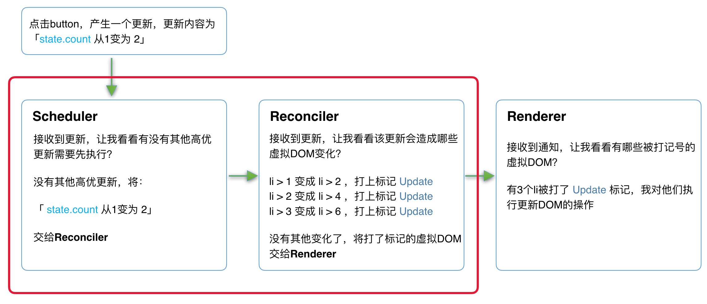
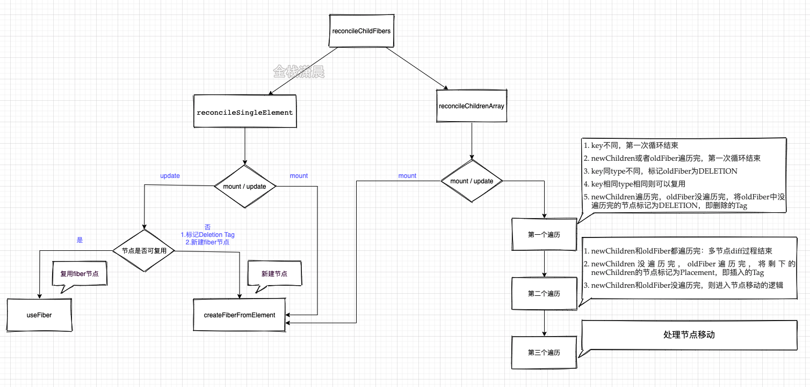
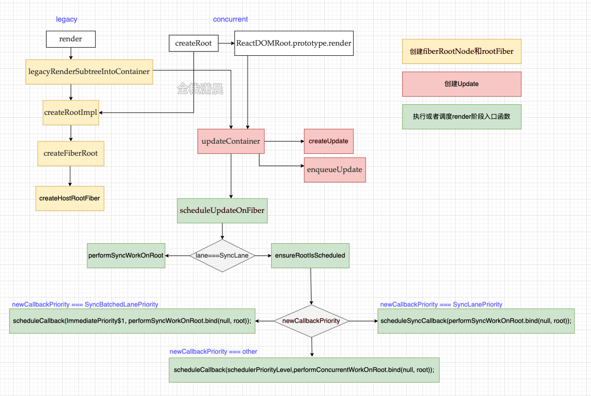

# React源码解析
### React的瓶颈
#### CPU的瓶颈
当项目变得庞大、组件数量繁多时，就会有CPU的瓶颈

我们知道主流浏览器刷新频率为60Hz，即每（1000ms / 60Hz）16.6ms浏览器刷新一次。
同时js可以操作DOM，GUI渲染线程与js线程是互斥的，所以JS脚本执行和浏览器布局、绘制不能同时执行

在每16.6ms时间内，需要完成如下工作：
`JS脚本执行 -----  样式布局 ----- 样式绘制`
当JS执行时间过长，超出了16.6ms，这次刷新就没有时间执行样式布局和样式绘制了。
`

React是如何解决这个问题的呢
在浏览器每一帧的时间中，预留一些时间给JS线程，React利用这部分时间更新组件（可以看到，在源码 (opens new window)中，预留的初始时间是5ms）。
当预留的时间不够用时，React将线程控制权交还给浏览器使其有时间渲染UI，React则等待下一帧时间到来继续被中断的工作。

所以，解决CPU瓶颈的关键是实现时间切片，而时间切片的关键是：`将同步的更新变为可中断的异步更新`。

### IO的瓶颈
前端无法处理


## React16 的架构分为三层
1. scheduler(调度器) —— 调度任务的优先级，高优任务优先进入Reconciler
2. Reconciler（协调器）—— 负责找出变化的组件
3. Renderer（渲染器）—— 负责将变化的组件渲染到页面上

### scheduler调度器
既然我们以浏览器是否有剩余时间作为任务中断的标准，那么我们需要一种机制，当浏览器有剩余时间时通知我们。

其实部分浏览器已经实现了这个API，这就是requestIdleCallback 
但是由于以下因素，React放弃使用：

* 浏览器兼容性
* 触发频率不稳定，受很多因素影响。比如当我们的浏览器切换tab后，之前tab注册的requestIdleCallback触发的频率会变得很低

基于以上原因，`React`实现了功能更完备的`requestIdleCallback`polyfill，这就是**Scheduler**。除了在空闲时触发回调的功能外，**Scheduler**还提供了多种调度优先级供任务设置。

在Scheduler中的每个任务的优先级使用过期时间表示的，如果一个任务的过期时间离现在很近，说明它马上就要过期了，优先级很高，如果过期时间很长，那它的优先级就低，没有过期的任务存放在timerQueue中，过期的任务存放在taskQueue中，timerQueue和taskQueue都是小顶堆，所以peek取出来的都是离现在时间最近也就是优先级最高的那个任务，然后优先执行它。

### Reconciler(协调器)

它的主要目标是：

- 能够把可中断的任务切片处理。
- 能够调整优先级，重置并复用任务。
- 能够在父元素与子元素之间交错处理，以支持 React 中的布局。
- 能够在 `render()` 中返回多个元素。
- 更好地支持错误边界。

在React15中，我们知道，在`React`中可以通过`this.setState`、`this.forceUpdate`、`ReactDOM.render`等API触发更新。

- 调用函数组件、或class组件的`render`方法，将返回的JSX转化为虚拟DOM
- 将虚拟DOM和上次更新时的虚拟DOM对比
- 通过对比找出本次更新中变化的虚拟DOM
- 通知**Renderer**将变化的虚拟DOM渲染到页面上

我们知道，在React15中**Reconciler**是递归处理虚拟DOM的，在V16中，更新工作从递归变成了可以中断的循环过程。每次循环都会调用`shouldYield`判断当前是否有剩余时间。(MessageChannel)

```js
function workLoopConcurrent() {
  // Perform work until Scheduler asks us to yield
  while (workInProgress !== null && !shouldYield()) {
    workInProgress = performUnitOfWork(workInProgress);
  }
}
```

那么React16是如何解决中断更新时DOM渲染不完全的问题呢？

Reconciler发生在render阶段，render阶段会分别为节点执行beginWork和completeWork（后面会讲），或者计算state，对比节点的差异，为节点赋值相应的effectFlags（对应dom节点的增删改）

协调器是在render阶段工作的，简单一句话概括就是Reconciler会创建或者更新Fiber节点。在mount的时候会根据jsx生成Fiber对象，在update的时候会根据最新的state形成的jsx对象和current Fiber树对比构建workInProgress Fiber树，这个对比的过程就是diff算法。

diff算法发生在render阶段的reconcileChildFibers函数中，diff算法分为单节点的diff和多节点的diff（例如一个节点中包含多个子节点就属于多节点的diff），单节点会根据节点的key和type，props等来判断节点是复用还是直接新创建节点，多节点diff会涉及节点的增删和节点位置的变化，详细见第9章。

reconcile时会在这些Fiber上打上Flags标签，在commit阶段把这些标签应用到真实dom上，这些标签代表节点的增删改，如

```js
export const Placement = /*             */ 0b0000000000010;
export const Update = /*                */ 0b0000000000100;
export const PlacementAndUpdate = /*    */ 0b0000000000110;
export const Deletion = /*              */ 0b0000000001000;
```

整个**Scheduler**与**Reconciler**的工作都在内存中进行。只有当所有组件都完成**Reconciler**的工作，才会统一交给**Renderer**。

render阶段遍历Fiber树类似dfs的过程，‘捕获’阶段发生在beginWork函数中，该函数做的主要工作是创建Fiber节点，计算state和diff算法，‘冒泡’阶段发生在completeWork中，该函数主要是做一些收尾工作，例如处理节点的props、和形成一条effectList的链表，该链表是被标记了更新的节点形成的链表

```js
顺便说下fiberRoot是整个项目的根节点，只存在一个，rootFiber是应用的根节点，可能存在多个，例如多个ReactDOM.render(<App />, document.getElementById("root"));
```

### Renderer（渲染器）

Renderer是在commit阶段工作的，commit阶段会遍历render阶段形成的effectList，并执行真实dom节点的操作和一些生命周期，不同平台对应的Renderer不同，例如浏览器对应的就是react-dom。

commit阶段发生在commitRoot函数中，该函数主要遍历effectList，分别用三个函数来处理effectList上的节点，这三个函数是commitBeforeMutationEffects、commitMutationEffects、commitLayoutEffects，他们主要做的事情如下，后面会详细讲解，现在在大脑里有一个结构就行

**Renderer**根据**Reconciler**为虚拟DOM打的标记，同步执行对应的DOM操作。

在React16架构中整个更新流程为：



其中红框中的步骤随时可能由于以下原因被中断：

- 有其他更高优任务需要先更新
- 当前帧没有剩余时间

由于红框中的工作都在内存中进行，不会更新页面上的DOM，所以即使反复中断，用户也不会看见更新不完全的DOM（即上一节演示的情况）。

## diff算法

在render阶段更新Fiber节点时，我们会调用reconcileChildFibers对比current Fiber和jsx对象构建workInProgress Fiber，这里current Fiber是指当前dom对应的fiber树，jsx是class组件render方法或者函数组件的返回值。

在reconcileChildFibers中会根据newChild的类型来进入单节点的diff或者多节点diff

```js
// packages/react-reconciler/src/ReactChildFiber.old.js
// 上一层是reconcileChildren
function reconcileChildFibers(
    returnFiber: Fiber, // work in progress fiber
    currentFirstChild: Fiber | null, // currrnt fiber 的子元素
    newChild: any,
    lanes: Lanes,
  ): Fiber | null {
    // 如果子节点是一个对象，并且不是null，且对象的type是fragment且key等于null
    const isUnkeyedTopLevelFragment =
      typeof newChild === 'object' &&
      newChild !== null &&
      newChild.type === REACT_FRAGMENT_TYPE &&
      newChild.key === null;
    if (isUnkeyedTopLevelFragment) {
      newChild = newChild.props.children;
    }
    // 那么直接将newChild赋值为newChild.props.children

    // 如果newChild是一个对象并且不为null
    if (typeof newChild === 'object' && newChild !== null) {
      switch (newChild.$$typeof) {
        case REACT_ELEMENT_TYPE: // 如果是一个元素 那么就会单一节点diff
          return placeSingleChild(// 
            reconcileSingleElement(
              returnFiber,
              currentFirstChild,
              newChild,
              lanes,
            ),
          );
        case REACT_PORTAL_TYPE: //如果是一个portal 那么就会单一节点diff
          return placeSingleChild(
            reconcileSinglePortal(
              returnFiber,
              currentFirstChild,
              newChild,
              lanes,
            ),
          );
        case REACT_LAZY_TYPE: // 如果是懒加载
          if (enableLazyElements) {
            const payload = newChild._payload;
            const init = newChild._init;
            // TODO: This function is supposed to be non-recursive.
            return reconcileChildFibers(
              returnFiber,
              currentFirstChild,
              init(payload),
              lanes,
            );
          }
      }

      if (isArray(newChild)) {
        return reconcileChildrenArray(// 多节点diff
          returnFiber,
          currentFirstChild,
          newChild,
          lanes,
        );
      }

      if (getIteratorFn(newChild)) {
        return reconcileChildrenIterator(
          returnFiber,
          currentFirstChild,
          newChild,
          lanes,
        );
      }

      throwOnInvalidObjectType(returnFiber, newChild);
    }
	  // 如果是一个string或者number，那么就会单节点diff，然后使用textNode去调节
    if (typeof newChild === 'string' || typeof newChild === 'number') {
      return placeSingleChild(
        reconcileSingleTextNode(
          returnFiber,
          currentFirstChild,
          '' + newChild,
          lanes,
        ),
      );
    }
    // 删除节点
    return deleteRemainingChildren(returnFiber, currentFirstChild);
  }
  // 将协调的节点返回
  return reconcileChildFibers;
}
```

```js
// packages/react-reconciler/src/ReactChildFiber.old.js
function placeSingleChild(newFiber: Fiber): Fiber {
  // This is simpler for the single child case. We only need to do a
  // placement for inserting new children.
  if (shouldTrackSideEffects && newFiber.alternate === null) {
    newFiber.flags |= Placement;
  }
  return newFiber;
}
```

```js
// packages/react-reconciler/src/ReactChildFiber.old.js
function reconcileSingleElement(
    returnFiber: Fiber, // work in progress
    currentFirstChild: Fiber | null, // children
    element: ReactElement, // 新的元素
    lanes: Lanes, // 优先级
  ): Fiber {
    const key = element.key; // 首先获取到key
    let child = currentFirstChild; // current fiber Node 的children
    while (child !== null) { // 如果children存在
      // TODO: If key === null and child.key === null, then this only applies to
      // the first item in the list.
      if (child.key === key) { // 如果current fiber的子元素的key等于当前元素的key
        const elementType = element.type; 
        if (elementType === REACT_FRAGMENT_TYPE) { // 元素的类型如果是Fragment
          if (child.tag === Fragment) { // 并且当前子元素的tag是fragment
            deleteRemainingChildren(returnFiber, child.sibling); // 删除已有的children
            const existing = useFiber(child, element.props.children); // clone一个fiber
            existing.return = returnFiber;// 将clone的fiber的return赋值为work in progress
            return existing;
          }
        } else {
          if (
            child.elementType === elementType || // 如果是元素类型相同
            // Keep this check inline so it only runs on the false path:
            (__DEV__
              ? isCompatibleFamilyForHotReloading(child, element)
              : false) ||
            (enableLazyElements &&
              typeof elementType === 'object' &&
              elementType !== null &&
              elementType.$$typeof === REACT_LAZY_TYPE &&
              resolveLazy(elementType) === child.type)
          ) {
            // 删除当前节点的兄弟节点
            deleteRemainingChildren(returnFiber, child.sibling);
            const existing = useFiber(child, element.props);
            existing.ref = coerceRef(returnFiber, child, element);
            existing.return = returnFiber;
            if (__DEV__) {
              existing._debugSource = element._source;
              existing._debugOwner = element._owner;
            }
            return existing;
          }
        }
        // Didn't match.
        deleteRemainingChildren(returnFiber, child);
        break;
      } else {
        deleteChild(returnFiber, child);
      }
      child = child.sibling;
    }

    if (element.type === REACT_FRAGMENT_TYPE) {
      const created = createFiberFromFragment(
        element.props.children,
        returnFiber.mode,
        lanes,
        element.key,
      );
      created.return = returnFiber;
      return created;
    } else {
      const created = createFiberFromElement(element, returnFiber.mode, lanes);
      created.ref = coerceRef(returnFiber, currentFirstChild, element);
      created.return = returnFiber;
      return created;
    }
  }
```


### diff过程的主要流程



#### diff算法的前提

1. 只对同级的比较，跨层级的dom不会复用
2. 不同类型节点生成的dom树不同，此时会直接销毁老节点以及子孙节点，并新建节点
3. 可以通过key来对元素diff过程提供复用的线索。

#### 单节点diff

有以下几种情况

1. key和type相同表示可以复用节点
2. key不同直接标记删除节点，然后新建节点
3. key和type不同，标记删除该节点和兄弟节点，然后新创建节点

```js

```


## Fiber

本质上就是虚拟DOM

在`React15`及以前，`Reconciler`采用递归的方式创建虚拟DOM，递归过程是不能中断的。如果组件树的层级很深，递归会占用线程很多时间，造成卡顿。

为了解决这个问题，`React16`将**递归的无法中断的更新**重构为**异步的可中断更新**，由于曾经用于递归的**虚拟DOM**数据结构已经无法满足需要。于是，全新的`Fiber`架构应运而生。

#### Fiber的含义

1. 作为架构来说，之前`React15`的`Reconciler`采用递归的方式执行，数据保存在递归调用栈中，所以被称为`stack Reconciler`。`React16`的`Reconciler`基于`Fiber节点`实现，被称为`Fiber Reconciler`。
2. 作为静态的数据结构来说，每个`Fiber节点`对应一个`React element`，保存了该组件的类型（函数组件/类组件/原生组件...）、对应的DOM节点等信息。
3. 作为动态的工作单元来说，每个`Fiber节点`保存了本次更新中该组件改变的状态、要执行的工作（需要被删除/被插入页面中/被更新...）。

### Fiber的架构

#### 有了Fiber这种数据结构后，能完成哪些事情呢

* 工作单元任务分解：Fiber最重要的功能就是作为工作单元，保存原生节点或者组件节点的对应的信息，这些节点通过指针的形式形成Fiber树
* 增量渲染：通过jsx对象和current Fiber的对比，生成最小的差异补丁，应用到真是节点上。
* 根据优先级暂停、继续、排列优先级：Fiber节点上保存了优先级，能通过不同节点优先级的对比，达到任务的暂停、继续、排列优先级等能力，也为上层实现批量更新、suspense提供了基础
* 保存状态：因为Fiber能保存状态和更新的信息，所以就能实现函数组件的状态更新，即hooks


#### Fiber的结构

```js
function FiberNode(
  tag: WorkTag,
  pendingProps: mixed,
  key: null | string,
  mode: TypeOfMode,
) {
  // 作为静态数据结构的属性
  this.tag = tag; // 对应组件的类型
  this.key = key; // key属性
  this.elementType = null; // 元素类型
  this.type = null; // func或者class
  this.stateNode = null; // 真实dom节点

  // 用于连接其他Fiber节点形成Fiber树
  this.return = null; //指向父节点
  this.child = null; // 指向子节点
  this.sibling = null; // 指向兄弟节点
  this.index = 0;

  this.ref = null;

  // 作为动态的工作单元的属性
  this.pendingProps = pendingProps; // 
  this.memoizedProps = null;
  this.updateQueue = null;
  this.memoizedState = null;
  this.dependencies = null;

  this.mode = mode;

  this.effectTag = NoEffect;
  this.nextEffect = null;

  this.firstEffect = null;
  this.lastEffect = null;

  // 调度优先级相关
  this.lanes = NoLanes;
  this.childLanes = NoLanes;

  //current和workInProgress的指针
  this.alternate = null;
}
```

#### 作为架构来说

每个Fiber节点有个对应的`React element`，多个`Fiber节点`是如何连接形成树呢？靠如下三个属性：

```js
// 指向父级Fiber节点
this.return = null;
// 指向子Fiber节点
this.child = null;
// 指向右边第一个兄弟Fiber节点
this.sibling = null;
```

#### 双缓存Fiber树

在`React`中最多会同时存在两棵`Fiber树`。当前屏幕上显示内容对应的`Fiber树`称为`current Fiber树`，正在内存中构建的`Fiber树`称为`workInProgress Fiber树`。

`current Fiber树`中的`Fiber节点`被称为`current fiber`，`workInProgress Fiber树`中的`Fiber节点`被称为`workInProgress fiber`，他们通过`alternate`属性连接。

* 在mount时：会创建fiberRoot和rootFiber，然后根据jsx对象创建Fiber节点，节点连接成current Fiber树。
* 在update时：会根据新的状态形成的jsx（ClassComponent的render或者FuncComponent的返回值）和current Fiber对比形（diff算法）成一颗叫workInProgress的Fiber树，然后将fiberRoot的current指向workInProgress树，此时workInProgress就变成了current Fiber。

fiberRoot：指整个应用的根节点，只存在一个

rootFiber：ReactDOM.render或者ReactDOM.unstable_createRoot创建出来的应用的节点，可以存在多个。

构建workInProgress Fiber发生在createWorkInProgress中，它能创建或者服用Fiber

```js
//ReactFiber.old.js
export function createWorkInProgress(current: Fiber, pendingProps: any): Fiber {
  let workInProgress = current.alternate; // 获取到正在构建的树
  if (workInProgress === null) {//区分是在mount时还是在update时
    workInProgress = createFiber(
      current.tag,
      pendingProps,
      current.key,
      current.mode,
    );
    workInProgress.elementType = current.elementType;
    workInProgress.type = current.type;
    workInProgress.stateNode = current.stateNode;
   
    workInProgress.alternate = current;
    current.alternate = workInProgress;
  } else {
    workInProgress.pendingProps = pendingProps;//复用属性
    workInProgress.type = current.type;
    workInProgress.flags = NoFlags;

    workInProgress.nextEffect = null;
    workInProgress.firstEffect = null;
    workInProgress.lastEffect = null;
    //...
  }
  workInProgress.childLanes = current.childLanes;//复用属性
  workInProgress.lanes = current.lanes;

  workInProgress.child = current.child;
  workInProgress.memoizedProps = current.memoizedProps;
  workInProgress.memoizedState = current.memoizedState;
  workInProgress.updateQueue = current.updateQueue;

  const currentDependencies = current.dependencies;
  workInProgress.dependencies =
    currentDependencies === null
      ? null
      : {
          lanes: currentDependencies.lanes,
          firstContext: currentDependencies.firstContext,
        };

  workInProgress.sibling = current.sibling;
  workInProgress.index = current.index;
  workInProgress.ref = current.ref;
  return workInProgress;
}
```


### Lane模型

react之前的版本用`expirationTime`属性代表优先级，该优先级和IO不能很好的搭配工作（io的优先级高于cpu的优先级），现在有了更加细粒度的优先级表示方法Lane，Lane用二进制位表示优先级，二进制中的1表示位置，同一个二进制数可以有多个相同优先级的位，这就可以表示‘批’的概念，而且二进制方便计算。

```js
//ReactFiberLane.js
export const NoLanes: Lanes = /* */ 0b0000000000000000000000000000000;
export const NoLane: Lane = /*   */ 0b0000000000000000000000000000000;

export const SyncLane: Lane = /* */ 0b0000000000000000000000000000001;
export const SyncBatchedLane: Lane = /**/ 0b0000000000000000000000000000010;

export const InputDiscreteHydrationLane: Lane = /**/ 0b0000000000000000000000000000100;
const InputDiscreteLanes: Lanes = /**/ 0b0000000000000000000000000011000;

const InputContinuousHydrationLane: Lane = /**/ 0b0000000000000000000000000100000;
const InputContinuousLanes: Lanes = /* d*/ 0b0000000000000000000000011000000;

export const DefaultHydrationLane: Lane = /**/ 0b0000000000000000000000100000000;
export const DefaultLanes: Lanes = /**/ 0b0000000000000000000111000000000;

const TransitionHydrationLane: Lane = /**/ 0b0000000000000000001000000000000;
const TransitionLanes: Lanes = /**/ 0b0000000001111111110000000000000;

const RetryLanes: Lanes = /**/ 0b0000011110000000000000000000000;

export const SomeRetryLane: Lanes = /**/ 0b0000010000000000000000000000000;

export const SelectiveHydrationLane: Lane = /* */ 0b0000100000000000000000000000000;

const NonIdleLanes = /*    */ 0b0000111111111111111111111111111;

export const IdleHydrationLane: Lane = /**/ 0b0001000000000000000000000000000;
const IdleLanes: Lanes = /*  */ 0b0110000000000000000000000000000;

export const OffscreenLane: Lane = /* d */ 0b1000000000000000000000000000000;
```


### setState
主要流程
setState --> enqueueSetState --> enqueueUpState --> isBatchingUpdates

​		 --> true(组件入队dirtyComponents)
​         --> false(循环更新dirtyComponents里的所有组件)

```js
const classComponentUpdater = {
  // isMounted
  enqueueSetState(inst, payload, callback) {
    const fiber = ReactInstanceMap.get(inst)
    const currentTime = requestCurrentTime()
    const expirationTime = computeExpirationForFiber(currentTime, fiber)

    const update = createUpdate(expirationTime)
    update.payload = payload
    if (callback !== undefined && callback !== null) {
      update.callback = callback
    }

    enqueueUpdate(fiber, update)
    scheduleWork(fiber, expirationTime)
  },
  // replaceState
  enqueueForceUpdate(inst, callback) {
    const fiber = ReactInstanceMap.get(inst)
    const currentTime = requestCurrentTime()
    const expirationTime = computeExpirationForFiber(currentTime, fiber)

    const update = createUpdate(expirationTime)
    update.tag = ForceUpdate

    if (callback !== undefined && callback !== null) {
      update.callback = callback
    }

    enqueueUpdate(fiber, update)
    scheduleWork(fiber, expirationTime)
  },
}
```

`setState`调用`updater.enqueueSetState`，我们先不管这个对象什么时候设置进来的，先来看一下代码

setState`和`forceUpdate`的代码我们可以看到，几乎是一模一样的。唯一的区别是`Update.tag

关于`Update`和`UpdateQueue`的数据结构可以看[这里](https://react.jokcy.me/book/api/react-structure.html)


### 总结

Fiber双缓存指的就是，在经过reconcile（diff）形成了新的workInProgress Fiber然后将workInProgress Fiber切换成current Fiber应用到真实dom中，存在双Fiber的好处是在内存中形成视图的描述，在最后应用到dom中，减少了对dom的操作。


## ReactElement
React Element通过createElement创建，调用该方法需要传入三个参数
* type：指代ReactElement的类型
  * 字符串比如`div`，`p`代表原生DOM，称为`HostComponent`
  * Class类型是我们继承自`Component`或者`PureComponent`的组件，称为`ClassComponent`
  * 方法就是`functional Component`
  * 原生提供的`Fragment`、`AsyncMode`等是Symbol，会被特殊处理
* config
* children

从源码可以看出虽然创建的时候都是通过`config`传入的，但是`key`和`ref`不会跟其他`config`中的变量一起被处理，而是单独作为变量出现在`ReactElement`上。

```js
export function createElement(type, config, children) {
	let propName;
  // Reserved names are extracted
  const props = {};
  let key = null;
  let ref = null;
  let self = null;
  let source = null;
  
  if (config != null) {
    if (hasValidRef(config)) {
      ref = config.ref;

      if (__DEV__) {
        warnIfStringRefCannotBeAutoConverted(config);
      }
    }
    if (hasValidKey(config)) {
      key = '' + config.key;
    }

    self = config.__self === undefined ? null : config.__self;
    source = config.__source === undefined ? null : config.__source;
    // Remaining properties are added to a new props object
    for (propName in config) {
      if (
        hasOwnProperty.call(config, propName) &&
        !RESERVED_PROPS.hasOwnProperty(propName)
      ) {
        props[propName] = config[propName];
      }
    }
  }
  // Resolve default props 主要是组件的形式
  if (type && type.defaultProps) {
    const defaultProps = type.defaultProps;
    for (propName in defaultProps) {
      if (props[propName] === undefined) {
        props[propName] = defaultProps[propName];
      }
    }
  }

  return ReactElement(
    type,
    key,
    ref,
    self,
    source,
    ReactCurrentOwner.current,
    props,
  );
}

const ReactElement = function(type, key, ref, self, source, owner, props) {
  const element = {
    // This tag allows us to uniquely identify this as a React Element
    $$typeof: REACT_ELEMENT_TYPE,
    // Built-in properties that belong on the element
    type: type,
    key: key,
    ref: ref,
    props: props,
    // Record the component responsible for creating this element.
    _owner: owner,
  };

  return element
}
```

在最后创建`ReactElement`我们看到了这么一个变量`$$typeof`，这是个啥呢，在这里可以看出来他是一个常量：`REACT_ELEMENT_TYPE`，但有一个特例：`ReactDOM.createPortal`的时候是`REACT_PORTAL_TYPE`，不过他不是通过`createElement`创建的，所以他应该也不属于`ReactElement`

`ReactElement`只是一个用来承载信息的容器，他会告诉后续的操作这个节点的以下信息：

1. `type`类型，用于判断如何创建节点
2. `key`和`ref`这些特殊信息
3. `props`新的属性内容
4. `$$typeof`用于确定是否属于`ReactElement`

这些信息对于后期构建应用的树结构是非常重要的，**而React通过提供这种类型的数据，来脱离平台的限制**

## React中的数据结构

### FiberRoot

```js
type BaseFiberRootProperties = {|
  // root节点，render方法接收的第二个参数
  containerInfo: any,
  // 只有在持久更新中会用到，也就是不支持增量更新的平台，react-dom不会用到
  pendingChildren: any,
  // 当前应用对应的Fiber对象，是Root Fiber
  current: Fiber,

  // 以下的优先级是用来区分
  // 1) 没有提交(committed)的任务
  // 2) 没有提交的挂起任务
  // 3) 没有提交的可能被挂起的任务
  // 我们选择不追踪每个单独的阻塞登记，为了兼顾性能
  // The earliest and latest priority levels that are suspended from committing.
  // 最老和新的在提交的时候被挂起的任务
  earliestSuspendedTime: ExpirationTime,
  latestSuspendedTime: ExpirationTime,
  // The earliest and latest priority levels that are not known to be suspended.
  // 最老和最新的不确定是否会挂起的优先级（所有任务进来一开始都是这个状态）
  earliestPendingTime: ExpirationTime,
  latestPendingTime: ExpirationTime,
  // The latest priority level that was pinged by a resolved promise and can
  // be retried.
  // 最新的通过一个promise被reslove并且可以重新尝试的优先级
  latestPingedTime: ExpirationTime,

  // 如果有错误被抛出并且没有更多的更新存在，我们尝试在处理错误前同步重新从头渲染
  // 在`renderRoot`出现无法处理的错误时会被设置为`true`
  didError: boolean,

  // 正在等待提交的任务的`expirationTime`
  pendingCommitExpirationTime: ExpirationTime,
  // 已经完成的任务的FiberRoot对象，如果你只有一个Root，那他永远只可能是这个Root对应的Fiber，或者是null
  // 在commit阶段只会处理这个值对应的任务
  finishedWork: Fiber | null,
  // 在任务被挂起的时候通过setTimeout设置的返回内容，用来下一次如果有新的任务挂起时清理还没触发的timeout
  timeoutHandle: TimeoutHandle | NoTimeout,
  // 顶层context对象，只有主动调用`renderSubtreeIntoContainer`时才会有用
  context: Object | null,
  pendingContext: Object | null,
  // 用来确定第一次渲染的时候是否需要融合
  +hydrate: boolean,
  // 当前root上剩余的过期时间
  // TODO: 提到renderer里面区处理
  nextExpirationTimeToWorkOn: ExpirationTime,
  // 当前更新对应的过期时间
  expirationTime: ExpirationTime,
  // List of top-level batches. This list indicates whether a commit should be
  // deferred. Also contains completion callbacks.
  // TODO: Lift this into the renderer
  // 顶层批次（批处理任务？）这个变量指明一个commit是否应该被推迟
  // 同时包括完成之后的回调
  // 貌似用在测试的时候？
  firstBatch: Batch | null,
  // root之间关联的链表结构
  nextScheduledRoot: FiberRoot | null,
|};
```


## 创建更新

在当前节点对应的`Fiber`对象上创建了`Update`之后，进就如`scheduleWork`调度阶段。

#### enqueueSetState
enqueueSetState 主要做了两件事

* 将新的state塞进组件的状态队列里
* 调用enqueueUpdate处理将要更新的实例对象


#### enqueueUpdate

- `batchingStrategy` 是`React`内部专门用于管控批量更新的对象，其`isBatchingUpdates`属性决定了当下是走更新流程还是排队等待，`batchedUpdates` 方法可以直接发起更新流程
- 将`batchingStrategy` 类比“锁管理器”，则`isBatchingUpdates`是`React`全局唯一的任务“锁”，它初始值为`false` 意味着当前并未进行任何批量更新操作
- 当`React`调用`batchedUpdates` 执行更新动作时，会先把“锁”给关上（置为`true`）表明现在正处于批量更新过程中
- 关上“锁”后，任何需要更新的组件依次入队等候下一次的批量更新

## jsx和核心api

### virtual Dom是什么

一句话概括就是，用js对象表示dom信息和结构，更新时重新渲染更新后的对象对应的dom，这个对象就是React.createElement()的返回结果


### Component

#### Component

```js
//ReactBaseClasses.js
const emptyObject = {};
function Component(props, context, updater) {
  this.props = props;//props属性
  this.context = context;//当前的context
  this.refs = emptyObject;//ref挂载的对象
  this.updater = updater || ReactNoopUpdateQueue;//更新的对像
}

Component.prototype.isReactComponent = {};//表示是classComponent
```

component函数中主要在当前实例上挂载了props、context、refs、updater等，所以在组件的实例上能拿到这些，而更新主要的承载结构就是updater， 主要关注isReactComponent，它用来表示这个组件是类组件

总结：jsx是React.createElement的语法糖，jsx通过babel转化成React.createElement函数，React.createElement执行之后返回jsx对象，也叫virtual-dom，Fiber会根据jsx对象和current Fiber进行对比形成workInProgress Fiber

#### PureComponent

```js
//ReactBaseClasses.js
function PureComponent(props, context, updater) {
  this.props = props;
  this.context = context;
  // If a component has string refs, we will assign a different object later.
  this.refs = emptyObject;
  this.updater = updater || ReactNoopUpdateQueue;
}

function ComponentDummy() {}
ComponentDummy.prototype = Component.prototype;

const pureComponentPrototype = (PureComponent.prototype = new ComponentDummy());
pureComponentPrototype.constructor = PureComponent;
// Avoid an extra prototype jump for these methods.
Object.assign(pureComponentPrototype, Component.prototype);
pureComponentPrototype.isPureReactComponent = true;
```

pureComponent也很简单，和component差不多，他会进行原型继承，然后赋值isPureReactComponent

## legacy和concurrent模式入口函数

react有三种进入主题函数的入口

* legacy: `ReactDom.render(<App/>, rootNode)`这是当前React APP使用的方式
* blocking: `ReactDOM.createBlockingRoot(rootNode).render(<App/>)`目前正在实验中，作为迁移到concurrent模式的第一个步骤
* concurrent: `ReactDOM.createRoot(rootNode).render(<App/>)` 目前在实验中，未来稳定之后，打算作为react的默认开发模式

### 不同模式在react运行时的含义

legacy模式是我们常用的，它构建dom的过程是同步的，所以在render的reconciler中，如果diff的过程特别耗时，那么导致的结果就是js一直阻塞高优先级的任务(例如用户的点击事件)，表现为页面的卡顿，无法响应。

concurrent Mode是react未来的模式，它用时间片调度实现了异步可中断的任务，根据设备性能的不同，时间片的长度也不一样，在每个时间片中，如果任务到了过期时间，就会主动让出线程给高优先级的任务



### legacy(ReactDOM.render)

#### render阶段整体流程


- 捕获阶段 从根节点rootFiber开始，遍历到叶子节点，每次遍历到的节点都会执行beginWork，并且传入当前Fiber节点，然后创建或复用它的子Fiber节点，并赋值给workInProgress.child。
- 冒泡阶段 在捕获阶段遍历到子节点之后，会执行completeWork方法，执行完成之后会判断此节点的兄弟节点存不存在，如果存在就会为兄弟节点执行completeWork，当全部兄弟节点执行完之后，会向上‘冒泡’到父节点执行completeWork，直到rootFiber。

#### beginWork

```js
function beginWork(
  current: Fiber | null,//当前存在于dom树中对应的Fiber树
  workInProgress: Fiber,//正在构建的Fiber树
  renderLanes: Lanes,//第12章在讲
): Fiber | null {
 // 1.update时满足条件即可复用current fiber进入bailoutOnAlreadyFinishedWork函数
  if (current !== null) {
    const oldProps = current.memoizedProps;
    const newProps = workInProgress.pendingProps;
    if (
      oldProps !== newProps ||
      hasLegacyContextChanged() ||
      (__DEV__ ? workInProgress.type !== current.type : false)
    ) {
      didReceiveUpdate = true;
    } else if (!includesSomeLane(renderLanes, updateLanes)) {
      didReceiveUpdate = false;
      switch (workInProgress.tag) {
        // ...
      }
      return bailoutOnAlreadyFinishedWork(
        current,
        workInProgress,
        renderLanes,
      );
    } else {
      didReceiveUpdate = false;
    }
  } else {
    didReceiveUpdate = false;
  }

  //2.根据tag来创建不同的fiber 最后进入reconcileChildren函数
  switch (workInProgress.tag) {
    case IndeterminateComponent: 
      // ...
    case LazyComponent: 
      // ...
    case FunctionComponent: 
      // ...
    case ClassComponent: 
      // ...
    case HostRoot:
      // ...
    case HostComponent:
      // ...
    case HostText:
      // ...
  }
}
```


采用ReactDOM.render,render调用legacyRenderSubtreeIntoContainer，最后createRootImpl会调用到createFiberRoot创建fiberRootNode,然后调用createHostRootFiber创建rootFiber，其中`fiberRootNode`是整个项目的的根节点，rootFiber是当前应用挂载的节点，也就是ReactDOM.render调用后的根节点。

创建完Fiber节点后，legacyRenderSubtreeIntoContainer调用updateContainer创建创建Update对象挂载到updateQueue的环形链表上，然后执行scheduleUpdateOnFiber调用performSyncWorkOnRoot进入render阶段和commit阶段


根据`ReactDOM.render`的调用情况也可以发现`parentComponent`是写死的`null`

`DOMRenderer.unbatchedUpdates`指定不使用`batchedUpdates`，因为这是初次渲染，需要尽快完成。

```js
// packages/react-dom/src/client/ReactDOMLegacy.js
ReactDOM = {
  render(
    element: React$Element<any>, // 要渲染的组件
    container: DOMContainer, // 挂载到哪个组件
    callback: ?Function, // 组件渲染完成后需要执行的回调函数
  ) {
    return legacyRenderSubtreeIntoContainer(
      null,
      element,
      container,
      false,
      callback,
    )
  },
}

```

#### legacyRenderSubtreeIntoContainer

```js
function legacyRenderSubtreeIntoContainer(
  parentComponent: ?React$Component<any, any>, // 没有父组件
  children: ReactNodeList, // 要渲染的组件
  container: DOMContainer, // 挂载到哪个组件
  forceHydrate: boolean, // true 为 服务端渲染，false为客户端渲染，我们研究的是客户端渲染
  callback: ?Function, // 组件渲染完成后需要执行的回调函数
) {
  let root: Root = (container._reactRootContainer: any) // 首次渲染root不存在
  let fiberRoot: FiberRoot;
  if (!root) {
    // Initial mount
    root = container._reactRootContainer = legacyCreateRootFromDOMContainer(// 创建root节点
      container,
      forceHydrate,
    )
    fiberRoot = root;
    if (typeof callback === 'function') {
      const originalCallback = callback;
      callback = function() {
        const instance = getPublicRootInstance(fiberRoot);
        originalCallback.call(instance);
      };
    }
    // Initial mount should not be batched.
    flushSyncWithoutWarningIfAlreadyRendering(() => {
      updateContainer(children, fiberRoot, parentComponent, callback);
    });
   
  } else {
    fiberRoot = root;
    if (typeof callback === 'function') {
      const originalCallback = callback;
      callback = function() {
        const instance = getPublicRootInstance(fiberRoot);
        originalCallback.call(instance);
      };
    }
    // Update
    updateContainer(children, fiberRoot, parentComponent, callback);
  }
  return DOMRenderer.getPublicRootInstance(root._internalRoot)
}
```


#### legacyCreateRootFromDOMContainer

```js
// 从root中创建根节点
function legacyCreateRootFromDOMContainer(
  container: Container, // 挂载的容器root
  forceHydrate: boolean, 
) {
  // 第一次清空任何已经存在的内容
  if (!forceHydrate) { // 客户端渲染的情况下
    let rootSibling;
    // 如果root上有其他元素存在，那么就将container上的元素删除掉
    while ((rootSibling = container.lastChild)) { 
      container.removeChild(rootSibling);
    }
  }
	
  const root = createContainer(
    container, // 挂载容器
    LegacyRoot, // 默认是0
    forceHydrate, // false
    null, // hydrationCallbacks
    false, // isStrictMode
    false, // concurrentUpdatesByDefaultOverride,
  );
  markContainerAsRoot(root.current, container);

  const rootContainerElement =
    container.nodeType === COMMENT_NODE ? container.parentNode : container; // nodetype === 8
  listenToAllSupportedEvents(rootContainerElement);
  return root;
}

export function markContainerAsRoot(hostRoot: Fiber, node: Container): void {
  node[internalContainerInstanceKey] = hostRoot;
}

```


#### createContainer

```js
//packages/react-reconciler/src/ReactFiberReconciler.old.js
export function createContainer(
  containerInfo: Container, // 挂载的容器root
  tag: RootTag, // 0
  hydrate: boolean, // 服务端渲染或者客户端渲染 false
  hydrationCallbacks: null | SuspenseHydrationCallbacks, null
  isStrictMode: boolean, // 不开启严格模式 false
  concurrentUpdatesByDefaultOverride: null | boolean, // false
) {
  return createFiberRoot(
    containerInfo,
    tag,
    hydrate,
    hydrationCallbacks,
    isStrictMode,
    concurrentUpdatesByDefaultOverride,
  );
}
```

#### createFiberRoot

```js
//packages/react-reconciler/src/ReactFiberRoot.old.js
function createFiberRoot(
  containerInfo: any, // 挂载的容器
  tag: RootTag, // 0
  hydrate: boolean, // 客户端渲染
  hydrationCallbacks: null | SuspenseHydrationCallbacks, // bull
  isStrictMode: boolean, // false
  concurrentUpdatesByDefaultOverride: null | boolean, // false
) {
   // 创建FiberRoot
  const root: FiberRoot = (new FiberRootNode(containerInfo, tag, hydrate): any);
  if (enableSuspenseCallback) { // 默认false
    root.hydrationCallbacks = hydrationCallbacks;
  }

  // Cyclic construction. This cheats the type system right now because
  // stateNode is any.
  // 创建rootFiber
  const uninitializedFiber = createHostRootFiber(
    tag, 
    isStrictMode,
    concurrentUpdatesByDefaultOverride,
  );
  root.current = uninitializedFiber; //rootFiber和fiberRootNode连接
  uninitializedFiber.stateNode = root; 

  if (enableCache) {
    const initialCache = new Map();
    root.pooledCache = initialCache;
    const initialState = {
      element: null,
      cache: initialCache,
    };
    uninitializedFiber.memoizedState = initialState;
  } else {
    const initialState = {
      element: null,
    };
    uninitializedFiber.memoizedState = initialState; // 以前的state
  }
	//创建updateQueue
  initializeUpdateQueue(uninitializedFiber);

  return root;
}

//对于HostRoot或者ClassComponent会使用initializeUpdateQueue创建updateQueue，然后将updateQueue挂载到fiber节点上
export function initializeUpdateQueue(fiber) {
  const queue: UpdateQueue<State> = {
    baseState: fiber.memoizedState,//初始state，后面会基于这个state，根据Update计算新的state
    firstBaseUpdate: null, //Update形成的链表的头
    lastBaseUpdate: null,//Update形成的链表的尾
    //新产生的update会以单向环状链表保存在shared.pending上，计算state的时候会剪开这个环状链表，并且连接在lastBaseUpdate后

    shared: {
      pending: null,
      interleaved: null,
      lanes: NoLanes,
    },
    effects: null,
  };
  fiber.updateQueue = queue;
}

function updateContainer(element, container, parentComponent, callback) {
  var lane = requestUpdateLane(current$1);//获取当前可用lane 在12章讲解
  var update = createUpdate(eventTime, lane); //创建update

  update.payload = {
    element: element//jsx
  };

  enqueueUpdate(current$1, update);//update入队
  scheduleUpdateOnFiber(current$1, lane, eventTime);//调度update
  return lane;
}

function scheduleUpdateOnFiber(fiber, lane, eventTime) {
  if (lane === SyncLane) {//同步lane 对应legacy模式
    //...
    performSyncWorkOnRoot(root);//render阶段的起点 render在第6章讲解
  } else {//concurrent模式
    //...
    ensureRootIsScheduled(root, eventTime);//确保root被调度
  } 
}
```

#### FiberRootNode

```js
function FiberRootNode(containerInfo, tag, hydrate) {
  this.tag = tag;
  this.containerInfo = containerInfo;
  this.pendingChildren = null;
  this.current = null;
  this.pingCache = null;
  this.finishedWork = null;
  this.timeoutHandle = noTimeout;
  this.context = null;
  this.pendingContext = null;
  this.hydrate = hydrate;
  this.callbackNode = null;
  this.callbackPriority = NoLane;
  this.eventTimes = createLaneMap(NoLanes);
  this.expirationTimes = createLaneMap(NoTimestamp);

  this.pendingLanes = NoLanes;
  this.suspendedLanes = NoLanes;
  this.pingedLanes = NoLanes;
  this.expiredLanes = NoLanes;
  this.mutableReadLanes = NoLanes;
  this.finishedLanes = NoLanes;

  this.entangledLanes = NoLanes;
  this.entanglements = createLaneMap(NoLanes);

  if (enableCache) {
    this.pooledCache = null;
    this.pooledCacheLanes = NoLanes;
  }

  if (supportsHydration) {
    this.mutableSourceEagerHydrationData = null;
  }

  if (enableSuspenseCallback) {
    this.hydrationCallbacks = null;
  }

  if (enableProfilerTimer && enableProfilerCommitHooks) {
    this.effectDuration = 0;
    this.passiveEffectDuration = 0;
  }

  if (enableUpdaterTracking) {
    this.memoizedUpdaters = new Set();
    const pendingUpdatersLaneMap = (this.pendingUpdatersLaneMap = []);
    for (let i = 0; i < TotalLanes; i++) {
      pendingUpdatersLaneMap.push(new Set());
    }
  }
}
```

#### createHostRootFiber

```js
function createHostRootFiber(
  tag: RootTag, // 0
  isStrictMode: boolean, // false
  concurrentUpdatesByDefaultOverride: null | boolean, // false
) {
  let mode;
  if (tag === ConcurrentRoot) { // 0 !== 1
    mode = ConcurrentMode;
    if (isStrictMode === true) {
      mode |= StrictLegacyMode;

      if (enableStrictEffects) {
        mode |= StrictEffectsMode;
      }
    } else if (enableStrictEffects && createRootStrictEffectsByDefault) {
      mode |= StrictLegacyMode | StrictEffectsMode;
    }
    if (
      // We only use this flag for our repo tests to check both behaviors.
      // TODO: Flip this flag and rename it something like "forceConcurrentByDefaultForTesting"
      !enableSyncDefaultUpdates ||
      // Only for internal experiments.
      (allowConcurrentByDefault && concurrentUpdatesByDefaultOverride)
    ) {
      mode |= ConcurrentUpdatesByDefaultMode;
    }
  } else {
    mode = NoMode; // 0b000000;
  }

  if (enableProfilerTimer && isDevToolsPresent) {
    // Always collect profile timings when DevTools are present.
    // This enables DevTools to start capturing timing at any point–
    // Without some nodes in the tree having empty base times.
    mode |= ProfileMode;
  }

  return createFiber(HostRoot, null, null, mode);
}
```

#### createFiber

```js
const createFiber = function(
  tag: WorkTag,
  pendingProps: mixed,
  key: null | string,
  mode: TypeOfMode,
) {
  // $FlowFixMe: the shapes are exact here but Flow doesn't like constructors
  return new FiberNode(tag, pendingProps, key, mode);
};
```

#### FiberNode

```js
function FiberNode(
  tag: WorkTag,
  pendingProps: mixed,
  key: null | string,
  mode: TypeOfMode,
) {
  // Instance
  this.tag = tag;
  this.key = key;
  this.elementType = null;
  this.type = null;
  this.stateNode = null;

  // Fiber
  this.return = null;
  this.child = null;
  this.sibling = null;
  this.index = 0;

  this.ref = null;

  this.pendingProps = pendingProps;
  this.memoizedProps = null;
  this.updateQueue = null;
  this.memoizedState = null;
  this.dependencies = null;

  this.mode = mode;

  // Effects
  this.flags = NoFlags;
  this.subtreeFlags = NoFlags;
  this.deletions = null;

  this.lanes = NoLanes;
  this.childLanes = NoLanes;

  this.alternate = null;

  if (enableProfilerTimer) {
    // Note: The following is done to avoid a v8 performance cliff.
    //
    // Initializing the fields below to smis and later updating them with
    // double values will cause Fibers to end up having separate shapes.
    // This behavior/bug has something to do with Object.preventExtension().
    // Fortunately this only impacts DEV builds.
    // Unfortunately it makes React unusably slow for some applications.
    // To work around this, initialize the fields below with doubles.
    //
    // Learn more about this here:
    // https://github.com/facebook/react/issues/14365
    // https://bugs.chromium.org/p/v8/issues/detail?id=8538
    this.actualDuration = Number.NaN;
    this.actualStartTime = Number.NaN;
    this.selfBaseDuration = Number.NaN;
    this.treeBaseDuration = Number.NaN;

    // It's okay to replace the initial doubles with smis after initialization.
    // This won't trigger the performance cliff mentioned above,
    // and it simplifies other profiler code (including DevTools).
    this.actualDuration = 0;
    this.actualStartTime = -1;
    this.selfBaseDuration = 0;
    this.treeBaseDuration = 0;
  }

  if (__DEV__) {
    // This isn't directly used but is handy for debugging internals:

    this._debugSource = null;
    this._debugOwner = null;
    this._debugNeedsRemount = false;
    this._debugHookTypes = null;
    if (!hasBadMapPolyfill && typeof Object.preventExtensions === 'function') {
      Object.preventExtensions(this);
    }
  }
}
```

### concurrent

- createRoot调用createRootImpl创建fiberRootNode和rootNode
- 创建完Fiber节点后，调用ReactDOMRoot.prototype.render执行updateContainer，然后scheduleUpdateOnFiber异步调度performConcurrentWorkOnRoot进入render阶段和commit阶段

**两种模式的不同点：**

1. createRootImpl中传入的第二个参数不一样 一个是LegacyRoot一个是ConcurrentRoot
2. requestUpdateLane中获取的lane的优先级不同
3. 在函数scheduleUpdateOnFiber中根据不同优先级进入不同分支，legacy模式进入performSyncWorkOnRoot，concurrent模式会异步调度performConcurrentWorkOnRoot

### setState

在react中触发状态更新的几种方式：

- ReactDOM.render
- this.setState
- this.forceUpdate
- useState
- useReducer

#### Component.prototype.setState

setState内调用this.updater.enqueueSetState

```js
// packages/react/src/ReactBaseClasses.js
Component.prototype.setState = function (partialState, callback) {
  if (!(typeof partialState === 'object' || typeof partialState === 'function' || partialState == null)) {
    {
      throw Error( "setState(...): takes an object of state variables to update or a function which returns an object of state variables." );
    }
  }
  this.updater.enqueueSetState(this, partialState, callback, 'setState');
};

enqueueSetState(inst, payload, callback) { // this实例，要更新的state，更新后的回调函数
  const fiber = getInstance(inst);//fiber实例 key._reactInternals
  
  const eventTime = requestEventTime();
  const suspenseConfig = requestCurrentSuspenseConfig();
    
  const lane = requestUpdateLane(fiber);//获取优先级
  
  const update = createUpdate(eventTime, lane, suspenseConfig);//创建update
  
  update.payload = payload;
  
  if (callback !== undefined && callback !== null) {  //赋值回调
    update.callback = callback;
  }
  
  enqueueUpdate(fiber, update);//update加入updateQueue
  scheduleUpdateOnFiber(fiber, lane, eventTime);//调度update
}
  
```

##### enqueueUpdate

```js
export function enqueueUpdate(
  fiber,
  update,
  lane,
) {
  const updateQueue = fiber.updateQueue;
  if (updateQueue === null) {// 卸载的时候
    // Only occurs if the fiber has been unmounted.
    return;
  }

  const sharedQueue: SharedQueue<State> = (updateQueue: any).shared;

  if (isInterleavedUpdate(fiber, lane)) {
    const interleaved = sharedQueue.interleaved;
    if (interleaved === null) {
      // This is the first update. Create a circular list.
      update.next = update;
      // At the end of the current render, this queue's interleaved updates will
      // be transfered to the pending queue.
      pushInterleavedQueue(sharedQueue);
    } else {
      update.next = interleaved.next;
      interleaved.next = update;
    }
    sharedQueue.interleaved = update;
  } else {
    const pending = sharedQueue.pending;
    if (pending === null) {
      // This is the first update. Create a circular list.
      update.next = update;
    } else {
      update.next = pending.next;
      pending.next = update;
    }
    sharedQueue.pending = update;
  }
}
```


#### forceUpdate

```js
// packages/react/src/ReactBaseClasses.js
Component.prototype.forceUpdate = function(callback) {
  this.updater.enqueueForceUpdate(this, callback, 'forceUpdate');
};

// packages/react-reconciler/src/ReactFiberClassComponent.old.js
enqueueForceUpdate(inst, callback) {
  const fiber = getInstance(inst); // this，指向当前组件
  const eventTime = requestEventTime();
  const lane = requestUpdateLane(fiber);

  const update = createUpdate(eventTime, lane);
  update.tag = ForceUpdate;

  if (callback !== undefined && callback !== null) {
    update.callback = callback;
  }

  enqueueUpdate(fiber, update, lane);
  const root = scheduleUpdateOnFiber(fiber, lane, eventTime);
  if (root !== null) {
    entangleTransitions(root, fiber, lane);
  }

  if (__DEV__) {
    if (enableDebugTracing) {
      if (fiber.mode & DebugTracingMode) {
        const name = getComponentNameFromFiber(fiber) || 'Unknown';
        logForceUpdateScheduled(name, lane);
      }
    }
  }

  if (enableSchedulingProfiler) {
    markForceUpdateScheduled(fiber, lane);
  }
}
//  packages/react-reconciler/src/ReactFiberWorkLoop.old.js
export function requestEventTime() {
  if ((executionContext & (RenderContext | CommitContext)) !== NoContext) {// 0 & (0b0010|0b0100) !== 0b0000
    // We're inside React, so it's fine to read the actual time.
    return now();
  }
  // We're not inside React, so we may be in the middle of a browser event.
  if (currentEventTime !== NoTimestamp) {
    // Use the same start time for all updates until we enter React again.
    return currentEventTime;
  }
  // This is the first update since React yielded. Compute a new start time.
  currentEventTime = now();
  return currentEventTime;
}

```


## 总结

React16的架构分为三层，有调度器、协调器、渲染器，

调度器用于调度任务的优先级，高优任务优先进入Reconciler，Reconciler负责找出变化的组件；Reconciler负责找出变化的组件


### JSX

首先是我们平时写的jsx,jsx就是createElement的语法糖，babel会将jsx转换成createElement函数调用，createElement函数通常需要传入三个参数type、config、children。

type是React元素的类型，可能是原生dom，可能是class组件，也可能是function组件，或者Fragment等等。

config是当前元素的一些属性，比如说class、style、key、ref等等。

children，就是当前元素的子元素，可以是组件、dom、或者文本。

在调用createElement的时候，

1. 首先会声明一些变量(key、ref)赋值为null，
2. 然后判断config是不是为null，
3. 如果不为null，那么判断是不是有有效的ref，如果有，那么就为ref赋值，
4. 然后判断是不是有key，有的话就赋值，
5. 然后判断self和source并赋值，
6. 之后遍历config，把除了保留属性外的其他config赋值给props(key, ref,\_\_self, __source)
7. 然后children属性，因为children属性可能是一个children，还可能是一个数组，首先判断arguments的长度
   1. 如果等于3，那么就直接将第三个向props上挂载children属性，
   2. 如果长度大于三，那么就会遍历得到一个children数组，然后将props.children属性赋值为这个数组。
8. 再往后就会判断是否存在defaultProps，如果存在的话，那么会遍历defaultProps，然后如果在props上没有挂载这个属性，那么就为其赋值，最后返回ReactElement的调用结果。
9. ReactElement中创建一个element对象，然后将传入的参数赋值到对象上，然后将对象返回